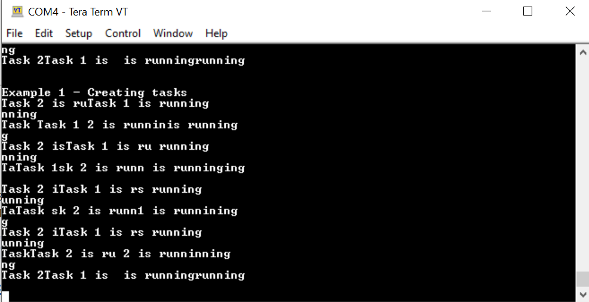

# TP3

primero se importan los proyectos poniendo la ruta del zip descargado del campus en el
asistente de importacion.

el asistente nos creara los proyectos con los archivos de las carpetas del zip

luego es neceario configurar el debugg de la siguiente manera:

terminados estos pasos se pueden construir los proyectos y comenzar a probarlos en la
placa ciaa

1b
el ejemplo 1 creating tasks utiliza las siguientes funciones:
funcion (nombre) ubicacion accion
prvSetupHardware freertos_examples_1_to_9.c inicia clock y hardware y
enciende el led 3
DEBUGOUT board_api.h es una macro para un print
xTaskCreate task.h crea tareas
vTaskStartScheduler tasks.c inicia el scheduler del SO

Las task 1 y 2 prenden y apagan el led 3 respectivamente y esperan una demora
1c
xTaskCreate recive el nombre de las tareas (declaradas como funciones), un string con el
nombre de las tareas, un uint de 16 bits que es el tamaño del stack,un puntero a los
parametros de las task, la prioridad y un puntero a algo llamado task handler
ejemplos:
para visualizar la informacion que imprimen las tareas por el puerto serial se utiliza el
TeraTerm

EJEMPLO 1:
se crean 2 tareas con la misma prioridad que imprimen por el serial port, como se alternan
indefinidamente y el tiempo que tardan en imprimir es mayor al timeslice los mensajes se
ven cortados e intercalados

EJEMPLO 2:
este ejemplo hace lo mismo pero de una manera diferente, crea dos tareas con la misma
prioridad partiendo de la misma funcion y lo que cambia es el parametreo que les pasa
cuando las crea, qu en este caso es el mensage que imprime por serial.

EJEMPLO 3:
este hace lo mismo pero cuando crea la tarea 2 le pone una prioridad mayor, y como esta
nunca se bloquea se ejecuta siempre la tarea 2.

EJEMPLO 4:
En este ejemplo se utiliza el task delay para poner en bloqued las tareas por un tiempo una
vez ejecturadas

EJEMPLO 5:
este ejemplo hace lo mismo que el anterior pero utilizando vtaskdelayuntil en vez de
vtaskdelay pero hace lo mismo

EJEMPLO 6:
este ejemplo combina una tarea periódica con 2 tareas continuas

EJEMPLO 7:
En este ejemplo se utiliza vApplicationIdleHook()

EJEMPLO 8:
En el ejemplo 8 las tareas usan el cambio de prioridad dinamico para cambiar la prioridad
de la tarea dos y hacer que se ejecute (cuando la 1 le sube la prioridad) y se deje de
ejecutar (cuando ella misma se cambia la prioridad)

EJEMPLO 9:

en este ejemplo se crea la tarea 1, la cual al ejecutarse crea la tarea 2 que solo se borra a si
misma

EJEMPLO 10:
en este ejemplo se sincronizan tareas consumidoras y creadoras mediante colas, la tarea
consumidora tiene mas prioridad pero se pone en bloked hasta que tenga datos para
procesar.

EJEMPLO 11:
en este ejemplo las tareas sender se ejecutan alternadamente hasta llenar la cola

EJEMPLO 12:
En este ejemplo se sincroniza una interrupción con una tarea gracias a un semaforo binario

EJEMPLO 13:
En este ejemplo se sincroniza una interrupción con una tarea usando un semaforo contador

EJEMPLO 14:
este ejemplo es simular al anterior pero usa dos colas, una para string y otra para enteros

EJEMPLO 15:
este ejemplo se utiliza un Mutex para proteger un recurso compartido, en este caso la UART

EJEMPLO 16:
este ejemplo es similar al anterior pero agrega una tarea de tichook periodica que que
genera otro texto para imprimir y lo manda al principio de la cola
(para que funcione bien se tuvo que cambiar en la libreria FreeRTOSConfig.h el valor de
configUSE_TICK_HOOK de 0 a 1)
(sin cambiar el valor)
.png)
(modificandolo)

